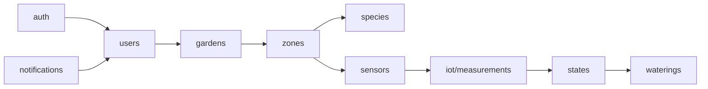

# Architecture & Conception — Jardin intelligent (Document d'ingénieur)

**Contexte** : API NestJS unique + Base relationnelle (PostgreSQL) + Connecteur IoT.  
But : fournir une architecture simple, robuste et prête à implémentation pour un PoC extensible.

---

## Table des matières

1. Architecture générale du système  
2. Composants & responsabilités  
3. Conception logique du backend  
   - Modules NestJS (structure)  
   - Entités principales (MLD résumé)  
   - Endpoints / Use cases  
   - Diagrammes (Mermaid)  
4. Conception technique du backend  
   - Stack, choix technos, ORM  
   - Ingestion IoT (connecteur)  
   - Règles métiers & algorithme d’état  
   - Jobs / scheduling / file d’attente  
   - Sécurité & authentification  
   - Observabilité, logs et monitoring  
   - Tests & CI/CD  
5. Plan d’implémentation (étapes)  
6. Annexes : DDL recommandé, exemples DTO, messages IoT

---

## 1. Architecture générale du système

### Vue fonctionnelle
- **Frontend(s)** : Dashboard web, Application mobile (consomment l’API REST).
- **API Backend (NestJS)** : logique métier, persistance relationnelle, endpoints admin/user.
- **Connecteur IoT** (module/service dans le même repo) : ingestion des mesures depuis les capteurs (HTTP ou MQTT) — prétraitement et persistance temps-série.
- **PostgreSQL** : données métiers (users, jardins, zones, espèces, besoins, arrosages, états, métadonnées capteurs).
- **Time-series DB (optionnel mais recommandé pour production)** : InfluxDB ou TimescaleDB pour les mesures brutes. Pour PoC on peut stocker références et échantillons dans Postgres si faible volume.
- **Actionneur** : endpoint / webhook / MQTT pour déclencher l’arrosage (via Gateway matérielle).

### Diagramme d’architecture (Mermaid)
```mermaid
flowchart LR
  UserApp[App Web / Mobile]
  API[API NestJS]
  IoTConnector[IoT Connector (module)]
  Postgres[PostgreSQL]
  TSDB[TimeSeries DB (InfluxDB/Timescale)]
  Actuator[Actuator Gateway]
  Logger[Logs & Monitoring]

  UserApp -->|REST| API
  API -->|CRUD| Postgres
  IoTConnector -->|store measures| TSDB
  IoTConnector -->|meta| Postgres
  IoTConnector -->|notify| API
  API -->|cmd| Actuator
  API --> Logger
  IoTConnector --> Logger
  
```

## 2. Composants & responsabilités
	•	API NestJS
	•	Expose endpoints REST pour users, jardins, zones, espèces, arrosages, états, notifications.
	•	Implémente la logique métier et les règles (RG).
	•	Authentifie/autorise (JWT).
	•	Connecteur IoT (dans la même application ou comme module séparé)
	•	Reçoit mesures (HTTP POST / MQTT).
	•	Valide / sanitize / enrichit données.
	•	Persiste mesures en TSDB et stocke référence dans Postgres (optionnel).
	•	Déclenche recalcul d’état (via service interne / event bus).
	•	Storage
	•	PostgreSQL : métadonnées & historique (arrosages, états, config).
	•	TSDB : mesures brutes et séries temporelles.
	•	Actuator Gateway
	•	Reçoit commandes d’arrosage (via webhook/MQTT) et contrôle vannes.
	•	Scheduler / Worker
	•	Gère tâches asynchrones (jobs d’agrégation, recalculs, notifications).

⸻

## 3. Conception logique du backend

### 3.1 Modules NestJS (proposition)

    Chaque module = dossier src/<module> contenant controller, service, entity, dto, module.
	•	auth — login, refresh token, guards, roles.
	•	users — gestion users, profils, rôles.
	•	gardens — CRUD jardins.
	•	zones — ZonesCulture (zone = unité de culture).
	•	species — EspècePlante + besoins.
	•	sensors — Capteur metadata & ingestion hooks (partie non-time-series).
	•	measurements (ou iot) — Connecteur IoT & services d’ingestion (publie vers TSDB).
	•	waterings — planification & historique des arrosages.
	•	states — calculs d’état & historique ETAT_ZONE.
	•	notifications — envoi d’emails/pushes.
	•	jobs — workers (BullMQ/Bull) pour tâches lourdes.
	•	common — pipes, interceptors, exceptions, utils.

### 3.2 Entités principales (résumé MLD)
	•	users (id_user PK, nom, email, password_hash, role)
	•	jardins (id_jardin PK, id_user FK, nom, localisation)
	•	espece_plante (id_espece PK, nom_commun, nom_scientifique)
	•	besoins_espece (id_besoins PK, id_espece FK, humidite_min, humidite_max, temp_min, temp_max, luminosite_min, frequence_arrosage_jours, quantite_eau_ml)
	•	zone_culture (id_zone PK, id_jardin FK, id_espece FK, nom_zone, superficie, etat_actuel_label, etat_actuel_date)
	•	capteur (id_capteur PK, id_zone FK, type_capteur, ref_hardware, active)
	•	donnee_capteur_ref (id_mesure PK, id_capteur FK, timestamp, valeur, unite, stored_in) — référence
	•	arrosage (id_arrosage PK, id_zone FK, date_debut, duree_seconds, type_declenchement, statut, created_by)
	•	etat_zone (id_etat PK, id_zone FK, date_etat, label, score_sante, commentaire)

### 3.3 Endpoints & use cases (exemples principaux)

    Auth / Users
        •	POST /auth/login — {email, password} → JWT
        •	POST /auth/refresh — refresh token
        •	GET /users/me — profil
        •	PATCH /users/me — maj profil

    Gardens & Zones
        •	POST /gardens — créer jardin
        •	GET /gardens — lister jardins de l’utilisateur
        •	POST /gardens/:gardenId/zones — créer zone (espèce, nom, superficie, settings)
        •	GET /gardens/:gardenId/zones — lister zones

    Species & Needs
        •	GET /species — lister espèces
        •	POST /species — créer espèce (admin)
        •	GET /species/:id/needs — besoins

    Sensors & IoT
        •	POST /sensors — enregistrer capteur (meta)
        •	POST /iot/measurements — ingestion HTTP (payload signé)
        •	POST /iot/mqtt-hook — endpoint pour gateway (optionnel)

    Payload d’un measurement:

```json
        {
        "sensor_id": "uuid",
        "timestamp": "2025-10-15T12:34:00Z",
        "type": "HUMIDITE_SOL",
        "value": 42.5,
        "unit": "%"
        }
 ```

    Watering
        •	POST /zones/:zoneId/watering — planifier arrosage manuel
        •	PATCH /waterings/:id/complete — marquer exécuté
        •	GET /zones/:zoneId/waterings — historique

    States & Dashboard
        •	GET /zones/:zoneId/state — état actuel (label + score + lastMeasures)
        •	GET /gardens/:gardenId/dashboard — résumé (zones, états, prochaines actions)

### 3.4 Diagramme modules (Mermaid)


⸻


## 4. Conception technique du backend

### 4.1 Stack recommandé
	•	Langage / Framework : Node.js, TypeScript, NestJS
	•	ORM : TypeORM / Prisma (préférence équipe). Exemple ci-dessous: TypeORM (intégration simple avec decorators @Entity)
	•	Database : PostgreSQL (Docker-compose pour dev)
	•	Time-series DB : optionnel mais conseillé — InfluxDB ou TimescaleDB
	•	Queue / Jobs : BullMQ (Redis) pour tâches asynchrones (recalcul état, notifications, retry)
	•	Auth : JWT (HS256 ou RS256), refresh token avec token store
	•	Validation : class-validator / DTOs
	•	Docs : Swagger (OpenAPI) — @nestjs/swagger
	•	Testing : Jest, Supertest
	•	Lint / Formatting : ESLint, Prettier
	•	CI/CD : GitHub Actions / GitLab CI

### 4.2 Ingestion IoT (connecteur)
	•	Modes d’ingestion :
	•	HTTP POST (API /iot/measurements) — pour gateway qui peut POST JSON.
	•	MQTT (optionnel) — une gateway MQTT (Mosquitto) peut forwarder vers API via webhook or bridge.
	•	Sécurité d’ingestion :
	•	API key par gateway/capteur (HMAC signature + timestamp) ou JWT client.
	•	Rate limit et validation strictes.
	•	Traitement :
	•	Validation schema (type, range).
	•	Normalisation (unités).
	•	Écriture asynchrone dans TSDB.
	•	Publication d’un événement interne (EventEmitter ou Redis pub/sub) pour recalcul d’état.
	•	Design :
	•	Exposer un IotService qui encapsule la logique d’écriture dans TSDB et l’eventing.
	•	Conserver métadonnées dans Postgres (capteur).

### 4.3 Règles métiers & algorithme d’état (concret)
	•	À la réception d’un batch de mesures pour une zone :
	1.	Récupérer les besoins_espece de la zone.
	2.	Agréger mesures récentes (fenêtre paramétrable — ex : 1h, 24h).
	3.	Calculer indices :
	•	humidite_score = f(mean_humidite, [min,max])
	•	temp_score = f(mean_temp, [min,max])
	•	Combiner en score_sante (pondération configurable).
	4.	Déterminer label selon seuils.
	5.	Persister etat_zone.
	6.	Si auto_watering_enabled && label correspond à déclenchement → créer job water_zone.
	7.	Envoyer notification si nécessaire.
	•	Nota : tous paramètres (fenêtre, poids, seuils) sont configurables globalement ou par zone.

### 4.4 Gestion des arrosages
	•	Arrosage = action sur zone.
	•	Chaque zone possède un identifiant valve_id (correspondant à l’actionneur).
	•	Pour déclenchement :
	•	Le backend envoie POST /gateway/actuate avec {valve_id, duration, auth}.
	•	Gateway renvoie ack : backend enregistre arrosage (statut EXECUTE).
	•	Fallback : si échec communication, retry via job queue et log erreur.

### 4.5 Jobs & scheduling
	•	BullMQ/Redis pour :
	•	Recalculs périodiques (cron jobs pour états).
	•	Retry d’envoi de commandes aux actionneurs.
	•	Envoi de notifications en différé.
	•	Exemples :
	•	Cron : every 5min -> verify zones with no measurements in last N hours -> notify.
	•	Job recomputeZoneState(zoneId).

### 4.6 Sécurité & RBAC
	•	Auth : JWT (access token court, refresh token long).
	•	Roles : admin, user, service (pour gateways).
	•	Guards : JwtAuthGuard, RolesGuard.
	•	Input safety : validation DTOs (class-validator), whitelist DTOs.
	•	Transport : HTTPS obligatoire en prod.
	•	Secrets : stocker dans Vault or env secrets, rotation tokens.
	•	Audit : journaliser actions sensibles (arrosage manuel, création device).

### 4.7 Observabilité & Logs
	•	Logs structured : pino / Winston JSON logs.
	•	Tracing : OpenTelemetry (optionnel) pour suivre requêtes ingestion → state calc → actionneur.
	•	Metrics : Prometheus exporter (NestJS metrics) ; dashboards Grafana.
	•	Alerting : erreurs critiques, queue backlog, TSDB down.

### 4.8 Tests & CI
	•	Unit tests : services, utils (Jest).
	•	Integration : controllers + DB (testcontainers ou sqlite pour CI).
	•	E2E : Supertest sur endpoints critiques (ingestion, arrosage).
	•	CI pipeline : lint → test → build → docker image → push.
	•	CD : deploy via Docker Compose / Kubernetes.

⸻

## 5. Plan d’implémentation (étapes pratiques)

    Phase 0 — Setup
        1.	Init repo NestJS + TypeScript.
        2.	Config TypeORM (Postgres), Docker-compose pour Postgres, Redis, InfluxDB (optionnel).
        3.	Setup ESLint, Prettier, Husky (pre-commit), CI pipeline.

    Phase 1 — Core model & auth
        1.	Implement users, auth, gardens, species, zones entities + migrations.
        2.	CRUD endpoints & tests unitaires.

    Phase 2 — Sensors & Ingestion PoC
        1.	Implement sensors module (meta) and simple /iot/measurements ingestion endpoint which writes into Postgres donnee_capteur_ref (PoC).
        2.	Implement IotService that forwards to TSDB (or Postgres in PoC).
        3.	Implement validation & API key auth for ingestion.

    Phase 3 — State computation & Watering
        1.	Implement states module with recomputeZoneState service.
        2.	Implement arrosage module + actuator endpoint simulation.
        3.	Implement job queue (BullMQ) for scheduling & retries.

    Phase 4 — Observability & polish
        1.	Add metrics, logging, swagger, docs.
        2.	Add notifications & user settings.
        3.	Add integration tests & prepare release.

⸻

## 6. Annexes

### 6.1 Exemple de payload IoT (HTTP)
```json
{
  "gateway_id": "gateway-uuid",
  "api_key": "xxxx",
  "measurements": [
    {"sensor_id":"uuid","type":"HUMIDITE_SOL","timestamp":"2025-10-15T12:00:00Z","value":45.2,"unit":"%"},
    {"sensor_id":"uuid2","type":"TEMP","timestamp":"2025-10-15T12:00:00Z","value":22.4,"unit":"°C"}
  ]
}
```
### 6.2 Exemple DTO (NestJS)
```ts
export class CreateMeasurementDto {
  @IsUUID() sensor_id: string;
  @IsString() type: 'HUMIDITE_SOL' | 'TEMP' | 'LUMI';
  @IsISO8601() timestamp: string;
  @IsNumber() value: number;
  @IsOptional() @IsString() unit?: string;
}
```
### 6.3 Recommandations déploiement (PoC -> Prod)
	•	PoC : Docker Compose (Postgres + Redis + InfluxDB + API)
	•	Prod : Kubernetes (Deployment, HPA), external secret manager, managed Postgres, Influx or Timescale managed

⸻

Checklist rapide (à valider par l’équipe)
	•	Confirm architecture (API unique + connector IoT) ✅
	•	Choix TSDB (InfluxDB vs TimescaleDB)
	•	Définir format & sécurité des payloads IoT (API key/HMAC)
	•	Décider stratégie auto-watering (on/off per zone)
	•	Migrations et naming conventions (TypeORM/Prisma)
	•	Test plan initial (unit + integration + e2e)

⸻

Notes finales / recommandations
	•	Pour ton PoC étudiant : démarre avec Postgres seul (stockage mixte des mesures limité) pour aller vite.
	•	Dès que le volume augmente, déplace les séries temporelles vers InfluxDB/TimescaleDB et garde Postgres pour la logique métier.
	•	Sépare logiquement l’ingestion IoT dans un module isolé (même si c’est dans le même repo) : ça facilitera la migration en microservice plus tard.

⸻


